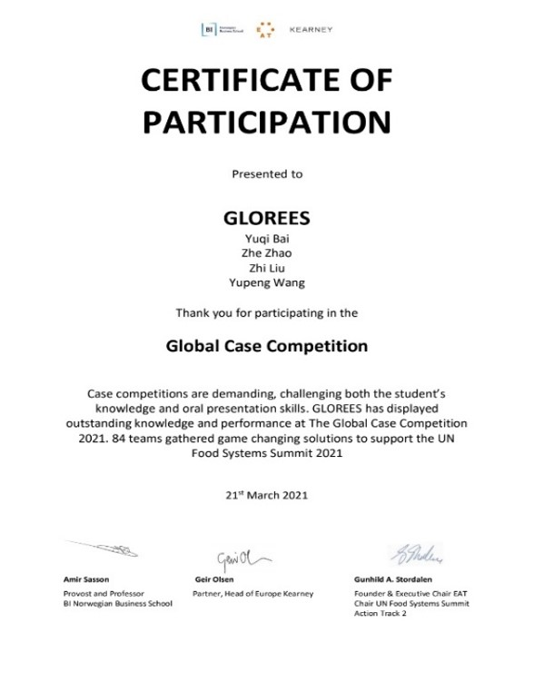
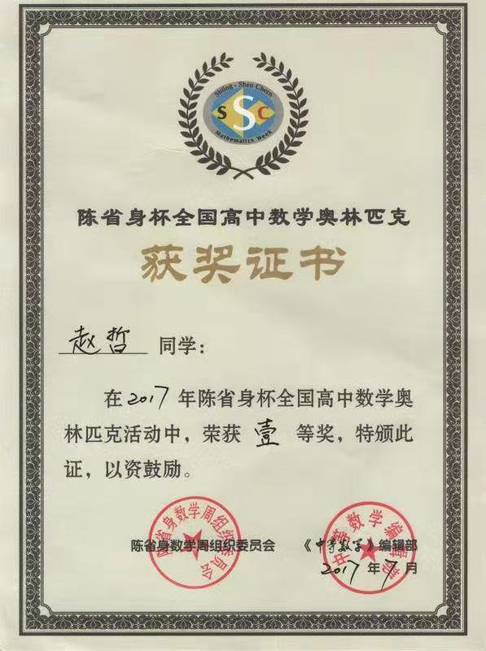

### Hi there, I'm [Zhe Zhao (赵哲 in Chinese)]([https://yimiandai.work/](https://scholar.google.com/citations?user=aSPDpmgAAAAJ&hl=zh-CN)), supervised by Lianru Gao 导师 高连如

📈 量化研究 / Quant Research （后续会在个人主页会pinned脱密后的相关代码）
- 金融时序建模：return prediction, trend / mean-reversion analysis, volatility modeling
- 特征工程：rolling mean/std，收益率与波动率特征，成交量特征，微观结构特征，情绪数据特征，宏观变量特征
- 因子稳定性处理：偏度/峰度，Hurst，Kalman平滑去噪，zscore平稳化
- 机器学习模型：GBDT(LightGBM, XGBoost, Random Forest), TabM, GRU
- 市场状态与无监督学习：HMM 市场状态划分，AE/VAE 特征降噪，聚类/深度无监督聚类，t-SNE 高维簇可视化
- 特征筛选与信号过滤：Spearman相关性分析，正交化去冗余，遗传算法特征筛选，meta-labeling 交易信号过滤
- 回测与评价框架：IC, Rank IC, IR, markouts, alpha power, 分层回测, walk-forward validation, Sharpe ratio

🤖 AI 与深度学习 / AI & Deep Learning
- 编程与数据处理：Python, PyTorch, NumPy, Pandas, Scikit-learn, Matplotlib
- 深度学习模型：CNN, Transformer, Attention Mechanism, Semantic Segmentation
- 多模态遥感 AI：光学/SAR 图像处理，多模态数据融合，遥感图像分割，建筑物提取，轻量化网络设计
- 模型训练与实验：数据预处理，模型训练，消融实验，特征可视化

🏅 Honors and Awards:
- 2015-2016: 全国高中数学联赛 二等奖
- 2015-2016: 浙江省高中数学竞赛 一等奖 （高一）
- 2016-2017: 中国科学技术大学 少年创新班 预录取
- 2016-2017: 陈省身杯全国高中数学奥林匹克竞赛 一等奖
- 2017-2018: 浙江省高中数学竞赛 一等奖 （185/200, 满分200，得分185，当年一等奖分数为102）
- 2018-2019: 国家奖学金（top 1%）
- 2019-2020: 国家奖学金（top 1%）
- 2019-2020: 山东省大学生测量技能大赛  特等奖
- 2020-2021: 中国石油奖学金（top 0.5%）
- 2020-2021: 全国大学生数学竞赛（非数学类）一等奖
- 2021-2022: 全国大学生数学建模竞赛 本科生组 二等奖
- 2021-2022: “航天宏图杯”PIE遥感与地理信息一体化软件二次开发大赛 一等奖
- 2021-2022: 第十七届“挑战杯”建设银行山东省大学生课外学术科技作品竞赛 一等奖
- 2021-2022: 第十七届“挑战杯”红色专项活动 一等奖
- 2021-2022: 我们团队的作品被共青团中央报道，并被中华全国青年联合会评选为优秀环保案例。
- 2021-2022: 参加联合国开发计划署“未来食物家”

  
  

- 2021-2022: 山东省优秀毕业生
- 2022-2023: 吉林一号’遥感开发者培训班线下集训营（长春站） 优秀学员（top 2%）
- 2024-2025：‘高分对地观测应用技术创新大赛’基于高分遥感影像耕地地块提取 优胜奖（第8名） 队长
- 2025-2026：Kaggle 竞赛 “CSIRO – Image2Biomass Prediction”银牌
- 2025-2026：第三届人工智能与遥感科学交叉论坛（AIRS-2026）优秀口头报告
- Others: 另有十余项国家、省部级（国家一级学会或省级单位盖章）荣誉奖励

📫 **How to reach me**:
- Wechat: TheBestOfMehah
- This is my email: zhaozhe22@mails.ucas.ac.cn

<!--
**983955163/983955163** is a ✨ _special_ ✨ repository because its `README.md` (this file) appears on your GitHub profile.

Here are some ideas to get you started:

- 🔭 I’m currently working on ...
- 🌱 I’m currently learning ...
- 👯 I’m looking to collaborate on ...
- 🤔 I’m looking for help with ...
- 💬 Ask me about ...
- 📫 How to reach me: ...
- 😄 Pronouns: ...
- ⚡ Fun fact: ...
-->

